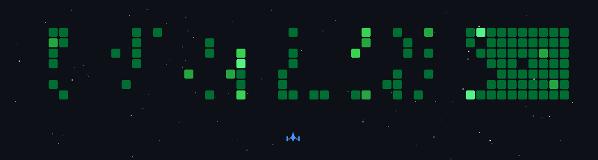

<!-- ## Hi there 👋 -->

<!--
**Subhadip6666/Subhadip6666** is a ✨ _special_ ✨ repository because its `README.md` (this file) appears on your GitHub profile.

Here are some ideas to get you started:

- 🔭 I’m currently working on ...
- 🌱 I’m currently learning ...
- 👯 I’m looking to collaborate on ...
- 🤔 I’m looking for help with ...
- 💬 Ask me about ...
- 📫 How to reach me: ...
- 😄 Pronouns: ...
- ⚡ Fun fact: ...
-->

# 👋 Hi, I'm Subhadip Patra

🎓 Engineering Student | 💻 C Programmer | 🚀 Aspiring Software & AI Developer  
📍 India  

I am focused on building strong fundamentals in **C programming, Data Structures, Operating Systems, and AI development**.  
My goal is to become a professional software engineer and crack competitive exams like **GATE**.

# GAME

    

## 🛠️ Skills

- **Languages:** C, Python (learning)
- **Core CS:** Data Structures, Algorithms, Operating Systems (beginner)
- **Tools:** Git, GitHub, VS Code
- **Areas of Interest:**  
  - System Programming  
  - AI & Machine Learning  
  - Open Source Projects  

## 📂 Projects

- 🖥️ **Basic OS Concepts Project** – Hobby OS exploration in C  
- 🧠 **AI Learning Projects** – Practice code for ML & Python  

(Projects are continuously being updated.)

## 📈 Goals for 2026

- Master **C & Data Structures**
- Build at least **5 solid projects**
- Learn **Python + Machine Learning**
- Contribute to **Open Source**
- Prepare seriously for **GATE Exam**

## 📊 GitHub Stats

  
  

## 📫 Contact Me

- GitHub: https://github.com/Subhadip6666  
- Email: subhadippatra789@gmail.com
- LinkedIn: https://www.linkedin.com/in/subhadip-patra-004532325

⚡ *"Consistency beats motivation. I code every day."*
